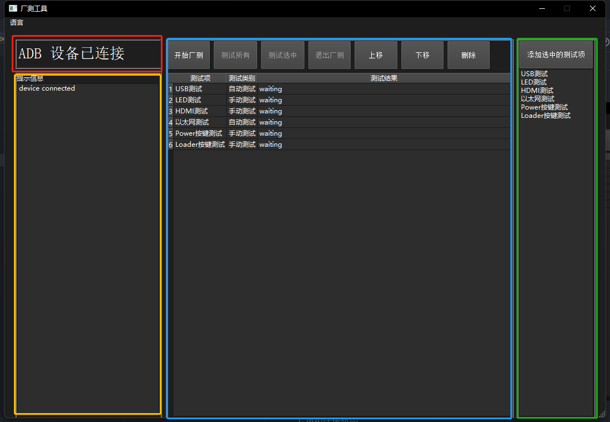

# 测试工具使用说明 

## 一、界面详解



1. 红色部分：显示 `设备`连接状态
2. 黄色部分：显示测试过程提示信息
3. 蓝色部分：显示测试项目删除测试项以及开始、停止测试
4. 绿色部分：显示所有测试项目，用于添加测试项
5. 语言： 默认为中文，需要切换成英文部分时点击上面语言选择 `English`即可

## 二、配置文件说明

配置文件是一个包含自动化和手动化工厂测试用例信息的文件。每个测试用例包括以下内容：

1. **描述**: 测试用例的简要描述，指明测试的目标或类型（自动化或手动化）。
2. **启用状态**: 测试用例是否处于启用状态（true 表示启用，false 表示禁用）。
3. **预期结果**: 针对自动化测试，指明测试的预期结果，例如数字或文本。
4. **测试标识符**: 一个唯一的标识符，用于区分不同的测试用例。
5. **启动命令**: 执行测试的命令，包括测试脚本的路径和参数。
6. **停止命令**（可选）: 仅对手动测试有意义，用于在测试完成后执行的命令。
7. **提示**（可选）: 仅对手动测试有意义，提供了测试操作的简要说明。

这些测试用例旨在测试设备的各个方面，包括以太网、USB、LED、HDMI、Power按键和Loader按键。用户可以根据需要启用或禁用这些测试用例，并根据预期结果来验证测试是否成功。

测试成功时会执行 `factory_test_finished` 脚本用于完成测试后的操作。根据命令行参数，它可以执行以下两种操作之一：

1. 启用老化测试：当使用 `-A` 或 `--agingtest` 参数时，脚本会执行老化测试相关的操作。
2. 禁用老化测试：如果没有提供 `-A` 或 `--agingtest` 参数，脚本会执行关闭adb，并将Usb配置adb写到启动脚本中。

默认情况下配置文件中没有启动老化测试，需要启动老化测试需要在config中修改 `TestFinished` 为

```yaml
TestFinished: /tmp/factorytest_bin/factory_test_finished -A

```
